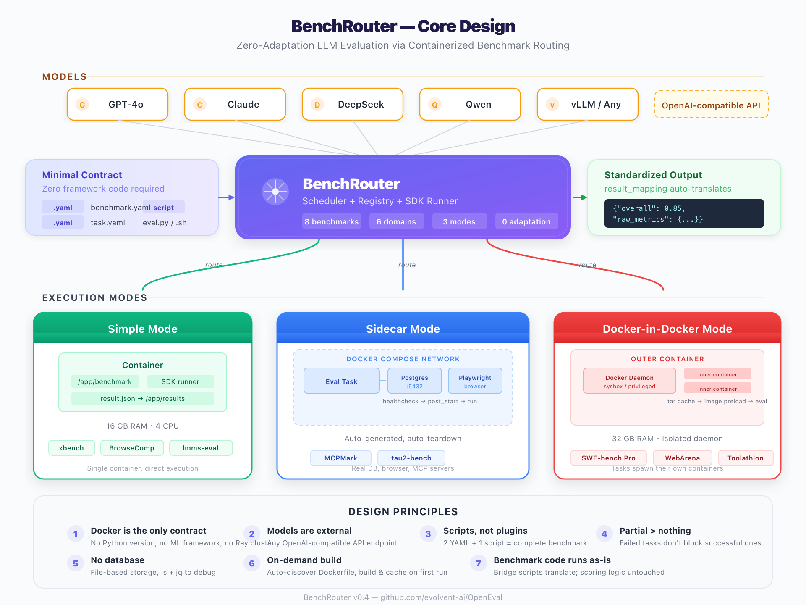

# BenchRouter: Zero-Adaptation LLM Evaluation via Containerized Benchmark Routing

**BenchRouter** is a lightweight evaluation-as-a-service platform that routes LLM evaluation requests to containerized benchmark environments with zero adaptation cost. Instead of requiring benchmark authors to write framework plugins or conform to monolithic evaluation toolkits, BenchRouter treats each benchmark as an opaque container that reads four environment variables and writes one JSON file. The platform currently unifies 8 benchmarks across 6 evaluation domains — from MCP tool calling to real-world software engineering — under a single `benchrouter run` command. Adding a new benchmark costs two YAML files and a script, not a framework migration.

## Motivation

The LLM evaluation landscape has a structural problem: benchmarks are plentiful, but running them is expensive. A 2025 survey cataloged over 100 distinct agent evaluation benchmarks ([arXiv:2503.16416](https://arxiv.org/abs/2503.16416)), yet the LangChain State of Agent Engineering report found that only 52.4% of organizations perform any offline evaluation before deploying agents to production. The gap is not caused by a lack of benchmarks — it is caused by the adaptation cost of running them.

We identify three sources of this adaptation cost:

**Adaptation Cost I — Framework lock-in.** Most evaluation platforms are organized around a plugin or adapter system. VLMEvalKit requires benchmark authors to implement Python classes within its framework. Harbor requires writing adapter code against its registry API. AgentBench hardcodes environment configurations. In every case, integrating a benchmark means rewriting evaluation logic to fit someone else's abstraction. For a benchmark author who already has working evaluation code, this is pure overhead.

**Adaptation Cost II — Rewriting risks from unified interfaces.** Existing frameworks pursue a "unified interface": every benchmark must conform to the same API calling convention, environment initialization, and result reporting format. This is especially damaging for agentic benchmarks. Agent evaluation pipelines are often tightly coupled with their environments — MCPMark requires multi-turn interactions against real PostgreSQL and Playwright instances, SWE-bench Pro generates and executes patches inside isolated Docker daemons, WebArena performs end-to-end operations on a full Magento installation. Rewriting these pipelines to fit a framework's unified interface is not just engineering-heavy — it risks introducing scoring divergence: the adapted harness may not faithfully reproduce the original benchmark's environment conditions and scoring logic, making the resulting scores incomparable with official results. BenchRouter avoids rewriting entirely: original benchmark code runs as-is, and the platform only handles routing and environment orchestration.

**Adaptation Cost III — Upstream synchronization burden.** Unified interfaces also create an ongoing maintenance problem: when an upstream benchmark repository updates (bug fixes, scoring changes, new tasks), the downstream adaptation code must be updated in lockstep, or evaluation results drift from community baselines. Maintainers must continuously track upstream changes and synchronize the adaptation layer — a compounding operational burden. BenchRouter's design avoids this at the root — bridge scripts only translate environment variables, never modify evaluation logic. When upstream updates, rebuilding the Docker image pulls the latest code; the bridge layer typically needs no changes at all.

The following table summarizes how BenchRouter compares to existing evaluation frameworks across these three dimensions:

| Framework | Integration | Code Rewrite Required | Upstream Sync |
|---|---|---|---|
| VLMEvalKit | Modify framework Python code | Heavy (unified interface) | Must sync adaptation layer |
| Harbor | Write adapter class | Moderate | Must sync adapter |
| AgentBench | Hardcoded configurations | Heavy (hardcoded envs) | Must rewrite config |
| **BenchRouter** | **2 YAML files + 1 script** | **Zero (original code as-is)** | **Rebuild image only** |

BenchRouter addresses all three costs simultaneously: a minimal contract protocol eliminates framework lock-in, running original benchmark code as-is avoids scoring divergence, and bridge scripts that only translate environment variables make upstream synchronization near zero-cost.

## Design Overview

The following diagram captures BenchRouter's end-to-end design — from model APIs at the top, through the routing core, down to the three containerized execution modes, with the minimal contract on the left and standardized output on the right.



The core principle is simple: **BenchRouter is a router, not a framework — it never modifies the original benchmark's logic.** This is what makes both onboarding and long-term maintenance cheap. Four design choices enforce this principle:

1. **Benchmark code runs as-is.** Bridge scripts translate environment variables; scoring logic is never modified. Whether the integration pattern is a 60-line bridge script, a Python API call with a compatibility patch, or patching a single function in the official codebase, the benchmark's original evaluation code runs unmodified. This is how BenchRouter avoids scoring divergence and eliminates the upstream synchronization burden described above.

2. **Docker is the only runtime contract.** No Python version requirement, no ML framework dependency, no Ray cluster. If it runs in a container, it runs on BenchRouter. This eliminates the "works on my machine" problem that plagues benchmark reproducibility — and means benchmark authors don't need to restructure their code to fit a platform's environment model.

3. **Models are external.** BenchRouter evaluates models; it does not serve them. Models run behind OpenAI-compatible APIs (vLLM, OpenAI, Anthropic, DeepSeek, any proxy). This separation means you can evaluate any model without modifying the evaluation platform.

4. **Scripts, not plugins.** The entire protocol for adding a benchmark is 2 YAML files and 1 script. No base classes to inherit, no framework to import, no plugin to register. Combined with principle 1, this means the integration cost is a thin translation layer, not a rewrite.

## Architecture

BenchRouter is a router, not a framework. Any program that reads environment variables and writes a JSON file is a valid evaluation task. The system is structured in four layers:

```
User Layer (CLI)
  └── benchrouter run <benchmark> --model <model>
        │
API Layer (FastAPI)
  └── POST /evals/submit → Run + N Jobs
        │
Core Layer (Scheduler + Registry)
  └── EvalScheduler: Run/Job hierarchy, semaphore concurrency
  └── Registry: file-based persistence (no database)
        │
Docker Execution Layer
  ├── Simple Mode:  1 container, 1 task (default)
  └── DinD Mode:    docker: true → isolated Docker daemon per task
```

**Run/Job hierarchy.** A single benchmark execution produces one Run containing N parallel Jobs (one per task). Jobs execute concurrently up to a configurable limit (default: 8). Failed tasks produce status PARTIAL rather than failing the entire run — partial results are still aggregated and reported.

**On-demand environment building.** Benchmark authors include a `Dockerfile` in their benchmark directory. BenchRouter auto-discovers it, builds the image on first use with per-environment locking to prevent race conditions, and caches the built image for subsequent runs. No manual `docker build`, no image registry.

**Result standardization.** The SDK runner inside each container reads the task's `result_mapping` configuration and translates benchmark-specific field names (e.g., `pass@1`, `accuracy`) into a standardized `{overall, raw_metrics}` schema. Cross-model comparison becomes a single API call.

## The Minimal Contract

Adding a benchmark to BenchRouter requires exactly three artifacts:

**1. `benchmark.yaml`** — declares the benchmark and its tasks:

```yaml
name: "my-benchmark"
tasks:
  - name: "task-a"
    environment: "my-env"
  - name: "task-b"
    environment: "my-env"
```

**2. `task.yaml`** — per-task configuration:

```yaml
name: "task-a"
command: "python eval.py"
timeout: 3600
result_mapping:
  overall: "pass@1"
```

**3. An evaluation script** — any executable. The contract is four environment variables in, one JSON file out:

| Input | Source |
|---|---|
| `BENCHROUTER_MODEL_ENDPOINT` | OpenAI-compatible API base URL |
| `BENCHROUTER_MODEL_NAME` | Model identifier |
| `OPENAI_API_KEY` | API key |
| `BENCHROUTER_OUTPUT_DIR` | Directory to write `result.json` |

A shell script that calls `curl` and writes `{"overall": 0.85}` is a valid benchmark task. No base classes. No framework imports. No plugin registration.

For benchmarks that need to spin up their own services (databases, browsers, web apps), set `docker: true` to enable DinD mode. Pre-cached images are listed in `docker_images` so the inner daemon loads them from tar archives instead of pulling from the network:

```yaml
name: "mcpmark-pg"
command: "python /app/benchmark/run_mcpmark.py"
timeout: 7200
docker: true
docker_images:
  - "pgvector/pgvector:0.8.0-pg17-bookworm"
extra_env:
  POSTGRES_HOST: "localhost"
  POSTGRES_PORT: "5432"
```

BenchRouter detects `docker: true`, allocates an isolated Docker daemon for the task (Sysbox or privileged), pre-loads the listed images from cache, and tears everything down when the task completes.

## Benchmark Coverage and Execution Modes

The scheduler decides how to run each task based on a single field in `task.yaml`: `docker`. If `docker: true` is set, the task gets its own Docker daemon (DinD mode); otherwise it runs directly inside a container (Simple mode). The following table consolidates all 8 integrated benchmarks:

| Benchmark | Domain | Tasks | Mode | Integration | Key Characteristic |
|---|---|---|---|---|---|
| **MCPMark** | Tool Calling | 4 | DinD | Bridge script (60 LOC) | Postgres + Playwright started inside DinD |
| **Toolathlon** | Tool Calling | 1 | DinD | Bridge script | 35+ MCP servers, no external credentials |
| **WebArena** | Web Interaction | 1 (182 sub-tasks) | DinD | Bridge script | 9.6GB Magento image, SOTA 61.7% completion |
| **BrowseComp** | Web Browsing | 1 | Simple | Bridge script | OpenAI simple-evals browser benchmark |
| **SWE-bench Pro** | Software Engineering | 8 (731 issues) | Simple | Official code + patch | Contamination-free; task-level Docker optional |
| **lmms-eval** | Multimodal | 1 (MMMU) | Simple | Python API + patch | 70+ image + 30+ video benchmarks |
| **tau2-bench** | Customer Service | 5 | Simple | Bridge script | Multi-domain dialogue, <50% GPT-4o success |
| **xbench** | Knowledge | 1 | Simple | Official code + patch | Encrypted dataset, contamination-free |

**Two execution modes** adapt to each benchmark's isolation needs:

- **Simple** (16 GB RAM, 4 CPU) — One container, one task. Benchmark directory mounted read-only at `/app/benchmark`, results written to `/app/results`. The container runs `python -m benchrouter.sdk.runner` with host networking. Used when the task itself does not need to spawn containers.
- **DinD** (32 GB RAM, 4 CPU) — Set `docker: true` in `task.yaml`. Each task gets an isolated Docker daemon via Sysbox runtime (preferred) or privileged mode. Pre-cached images are loaded from tar archives into the inner daemon to avoid multi-GB network pulls. The container runs `dind-entrypoint.sh` which starts the daemon, loads images, then invokes the SDK runner. Used when the benchmark needs to start its own containers internally (databases, web servers, per-instance Docker images).

**Three integration patterns** together validate the minimal contract:

**Bridge script pattern** (MCPMark, WebArena, BrowseComp, tau2-bench) — A thin bridge script translates BenchRouter's environment variables into the upstream benchmark's expected parameters, calls the benchmark's official pipeline, and converts the output to `result.json`. The bridge script for MCPMark is 60 lines.

**Python API + patch pattern** (lmms-eval) — Calls the benchmark's `evaluator.simple_evaluate()` API directly. A runtime monkey-patch converts `image_url` message format for Anthropic API compatibility. Evaluation logic is untouched.

**Official code + patch pattern** (xbench, SWE-bench Pro) — Dockerfile clones the official repository. The bridge script patches a single function (e.g., `language_models.get_llm_response()` to route through BenchRouter's model API) and calls the official `main()`. All scoring logic runs unmodified.

In every case, the benchmark's original evaluation code runs as-is. BenchRouter does not re-implement scoring, question sampling, or environment setup. It routes.

## Integration Case Study: MCPMark

MCPMark evaluates LLM agents on MCP (Model Context Protocol) tool calling across four tasks: filesystem manipulation, PostgreSQL queries, Playwright browser control, and WebArena interaction. Tasks that need external services (PostgreSQL, Playwright) use DinD mode — the database or browser is started inside the task's own Docker daemon, configured via `docker: true` and `docker_images` in `task.yaml`.

Integrating MCPMark into BenchRouter required:

1. A `benchmark.yaml` declaring 4 tasks with their respective environments.
2. Per-task `task.yaml` files specifying `docker: true` and listing the images to pre-load (e.g., `pgvector/pgvector:0.8.0-pg17-bookworm`). Connection details are passed via `extra_env`.
3. A 60-line bridge script per task that reads `BENCHROUTER_MODEL_ENDPOINT` and `BENCHROUTER_MODEL_NAME`, configures the upstream MCPMark client via LiteLLM, runs the evaluation, and writes `result.json`.

No MCPMark evaluation code was modified. The entire integration — four tasks across filesystem, PostgreSQL, Playwright, and WebArena — took one afternoon.

## Integration Case Study: SWE-bench Pro

SWE-bench Pro presents the most demanding isolation requirement in BenchRouter. Each of its 731 tasks generates a Docker image containing a Python repository at a specific commit, applies the agent's patch, and runs the project's test suite. This means the evaluation itself needs a Docker daemon.

BenchRouter's DinD mode handles this by:

1. Detecting whether the host has Sysbox runtime (preferred for security) or falling back to privileged mode.
2. Mounting a per-task directory at `/var/lib/docker` inside the DinD container, giving each task isolated Docker storage.
3. Pre-loading the SWE-bench base images from cached tar archives (avoiding multi-minute pulls for each task).
4. Starting the inner Docker daemon with overlay2 (falling back to vfs on kernels that don't support stacked overlay2).
5. Running the SWE-bench evaluation harness inside the DinD container with full Docker access.

The 8 task shards run in parallel, each with its own Docker daemon, 32GB RAM allocation, and isolated storage. A run that completes 6 of 8 shards returns status PARTIAL with aggregated scores for the completed shards.

## What's Next

BenchRouter's immediate priorities are:

- **Additional MCP benchmarks.** MCP-Universe (Salesforce, 6 domains, GPT-5 scores 43.7%) and GAIA (466 real-world questions) are natural next integrations as the MCP ecosystem grows past 97 million monthly SDK downloads.
- **Cloud-native scaling.** Distributing Docker execution across multiple hosts for large-scale evaluation campaigns.
- **Persistent leaderboard.** Cross-model comparison that spans evaluation campaigns, not just single runs.
- **RL reward integration.** Connecting BenchRouter's standardized result format with reinforcement learning pipelines, so evaluation scores become training signals rather than just report cards.

The code is open source. The protocol is intentionally minimal. If you have a benchmark that runs in a container, BenchRouter can route to it.

GitHub: [github.com/evolvent-ai/BenchRouter](https://github.com/evolvent-ai/BenchRouter)
