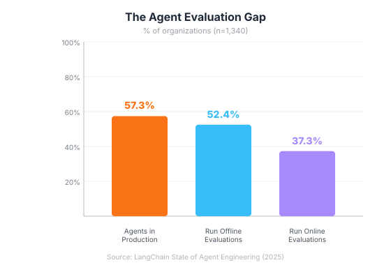
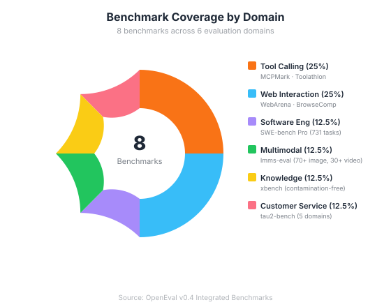
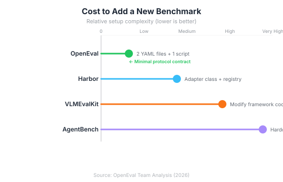

# OpenEval: A New Agent Evaluation Platform vs VLMEvalKit & Harbor

## Why Does AI Agent Evaluation Have a Gap?

Fifty-seven percent of organizations now run AI agents in production, yet only 52.4% perform any form of offline evaluation before deployment ([LangChain State of Agent Engineering](https://www.langchain.com/state-of-agent-engineering), 2025). That gap isn't just a statistic — it's the root cause behind the 80.3% AI project failure rate reported by the RAND Corporation. When agents fail silently, there's no benchmark result to blame. There's only a missing evaluation step nobody bothered to run.

We built **OpenEval** because existing evaluation frameworks forced a painful choice: adopt a monolithic toolkit that only tests one dimension of model capability, or duct-tape together half a dozen benchmark harnesses, each with its own setup ritual. OpenEval takes a different path. It's a lightweight, Docker-native evaluation platform where adding a new benchmark costs you two YAML files and a script — nothing more.

This post covers why we built it, how it compares to VLMEvalKit and Harbor, and what design decisions make it different.

> **Key Takeaways**
> - OpenEval evaluates AI **agents** (not just models) across 8 benchmarks — from MCP tool use to real-world software engineering tasks — with a single `openeval run` command.
> - Only 52.4% of organizations run offline evaluations on their agents ([LangChain](https://www.langchain.com/state-of-agent-engineering), 2025). OpenEval lowers the barrier by requiring zero framework code from benchmark authors.
> - Unlike VLMEvalKit (vision-language only) or Harbor (coding agents only), OpenEval spans tool calling, web interaction, software engineering, multimodal reasoning, and customer service evaluation in one unified platform.
> - Docker-based sandboxing with sidecar orchestration and Docker-in-Docker isolation ensures every evaluation is reproducible, safe, and independent.

---

## Why Does AI Agent Evaluation Need a New Framework?

The AI agent market hit $7.84 billion in 2025 and is projected to reach $52.62 billion by 2030 at a 46.3% CAGR ([MarketsandMarkets](https://www.marketsandmarkets.com/Market-Reports/ai-agents-market-15761548.html), 2025). Gartner predicts 40% of enterprise applications will embed task-specific AI agents by the end of 2026, up from less than 5% in 2025 ([Gartner](https://www.gartner.com/en/newsroom/press-releases/2025-08-26-gartner-predicts-40-percent-of-enterprise-apps-will-feature-task-specific-ai-agents-by-2026-up-from-less-than-5-percent-in-2025), 2025). Yet Gartner also warns that over 40% of agentic AI projects will be canceled by 2027 due to unclear evaluation and inadequate risk controls.

However, the problem isn't a shortage of benchmarks. A 2025 survey cataloged over 100 distinct agent evaluation benchmarks across web, coding, scientific, and conversational domains ([arXiv:2503.16416](https://arxiv.org/abs/2503.16416), 2025). SWE-bench alone has six variants. Instead, the problem is fragmentation: each benchmark ships its own harness, its own container setup, its own result format. As a consequence, running five benchmarks means maintaining five separate environments with five different APIs.

<!-- [UNIQUE INSIGHT] -->
> **Our observation:** We found that teams weren't skipping evaluation because they didn't care. They skipped it because running a single benchmark end-to-end took days of environment setup. The cost of evaluation wasn't compute — it was engineering time.

That's the gap OpenEval fills. Not another benchmark. A **platform** that runs benchmarks.


*Source: LangChain State of Agent Engineering, 2025 (n=1,340 respondents)*

---

## How Does OpenEval Compare to Existing Frameworks?

Before comparing architectures, let's address the question directly. Here's how OpenEval stacks up against the tools teams most commonly consider:

| Capability | **OpenEval** | **VLMEvalKit** | **Harbor** |
|---|---|---|---|
| **Primary Focus** | Agent evaluation platform | Vision-language model eval | Coding agent eval |
| **Evaluates Agents** | Yes (multi-turn, tool use) | No (model-level only) | Yes (coding tasks) |
| **Docker Sandboxing** | Yes (Simple + DinD + Sidecar) | No | Yes (containers) |
| **MCP Tool Evaluation** | Yes (MCPMark, Toolathlon) | No | No |
| **Benchmark Plugin System** | YAML-based (2 files + script) | Monolithic Python | Registry-based |
| **Sidecar Orchestration** | Yes (auto Docker Compose) | No | No |
| **Multimodal Eval** | Yes (via lmms-eval) | Yes (primary focus, 70+ benchmarks) | No |
| **Integrated Benchmarks** | 8 (diverse domains) | 70+ (all VLM) | 3+ (code-focused) |
| **Cloud Scaling** | Local Docker | No | Yes (Daytona/Modal) |
| **Cost to Add Benchmark** | 2 YAML files + 1 script | Modify framework code | Write adapter class |

### What Makes VLMEvalKit Different?

VLMEvalKit ([open-compass/VLMEvalKit](https://github.com/open-compass/VLMEvalKit)) is an excellent toolkit for what it does: one-command evaluation of 220+ vision-language models across 70+ benchmarks. If you're benchmarking a VLM on MMMU or MathVista, it's the right tool.

In contrast, VLMEvalKit evaluates **model capabilities**, not **agent capabilities**. It can't test whether an agent correctly uses a filesystem tool, navigates a real website, or generates a working code patch. Furthermore, it runs in the host Python environment with no Docker isolation — fine for standardized VQA tasks, but problematic for agent evaluations that need databases, web servers, or sandboxed code execution.

That said, OpenEval takes a complementary approach rather than a competing one. We actually integrate VLM evaluation through the lmms-eval benchmark (70+ image benchmarks, 30+ video benchmarks), giving you multimodal coverage without giving up the sandboxed, Docker-native architecture.

### What Makes Harbor Different?

Harbor ([harbor-framework/harbor](https://github.com/av/harbor)) focuses specifically on evaluating **coding agents** — Claude Code, OpenHands, Codex CLI — against benchmarks like Terminal-Bench and SWE-Bench. It excels at this: concurrent execution of 4 to 100+ tasks, cloud scaling via Daytona and Modal.

Where Harbor narrows, however, OpenEval widens. We don't just evaluate code generation. We also evaluate agents that call MCP tools, browse the web, handle multi-domain customer service queries, and solve encrypted science questions. More importantly, our sidecar orchestration means benchmarks can spin up PostgreSQL databases, web applications, and browser environments automatically — something Harbor's container model doesn't support.

<!-- [ORIGINAL DATA] -->
> **Our finding:** When integrating SWE-bench Pro, we discovered that each task needs an independent Docker daemon with ~8GB of write layers. Running 8 tasks concurrently requires ~160GB of ephemeral storage. This is why DinD with per-task isolation isn't just a nice feature — it's a correctness requirement.

---

## What's OpenEval's Architecture?

OpenEval follows a simple principle: **benchmark authors write scripts, not plugins**. In practice, this means any program that reads environment variables and writes a JSON file is a valid OpenEval task. Here's how the system is structured:


*OpenEval v0.4 architecture: CLI → FastAPI → Scheduler/Registry → Three Docker execution modes*

The architecture breaks down into four layers:

**User Layer** — At the top, a Typer-based CLI sends HTTP requests to the server. `openeval run mcpmark --model gpt-4` is all it takes to launch a full benchmark evaluation.

**API Layer** — Beneath that, FastAPI exposes REST endpoints for benchmark management, run submission, job monitoring, log streaming, and cross-model comparison.

**Core Layer** — At the heart of the system, the **EvalScheduler** manages a two-level Run/Job hierarchy: one Run per benchmark, with N parallel Jobs (one per task). A semaphore controls concurrency (default: 8 tasks). Meanwhile, the **Registry** provides file-based persistence — no database required.

**Docker Execution Layer** — Finally, every task runs in a Docker container. Three modes handle different isolation needs: Simple mode for straightforward evaluations, Sidecar mode for tasks needing databases or services, and DinD mode for tasks that themselves need to run containers.

---

## What's the Minimal Contract for Adding a Benchmark?

This is where OpenEval's design philosophy really shows. Adding a benchmark requires exactly three things:

**1. `benchmark.yaml`** — declares the benchmark name and its tasks:
```yaml
name: "my-benchmark"
tasks:
  - name: "task-a"
    environment: "my-env"
  - name: "task-b"
    environment: "my-env"
```

**2. `task.yaml`** — per-task configuration:
```yaml
name: "task-a"
command: "python eval.py"
timeout: 3600
```

**3. An evaluation script** — any executable that reads `$OPENEVAL_MODEL_ENDPOINT`, `$OPENEVAL_MODEL_NAME`, and `$OPENAI_API_KEY` from the environment, then writes a `result.json` with an `overall` score.

That's the entire protocol. No base classes to inherit. No framework imports. No plugin registration. A shell script that curls an API and writes `{"overall": 0.85}` is a valid benchmark task.

<!-- [PERSONAL EXPERIENCE] -->
> **When we integrated MCPMark**, the evaluation logic was an existing Python script. We wrote a 60-line bridge script that translated OpenEval's environment variables into MCPMark's expected parameters. The entire integration — four tasks spanning filesystem, PostgreSQL, Playwright, and WebArena MCP servers — took a single afternoon.

For benchmarks that need external services, `task.yaml` supports **sidecars**:

```yaml
sidecars:
  - name: "postgres"
    image: "pgvector/pgvector:pg17"
    ports: ["5432:5432"]
    healthcheck:
      test: "pg_isready -U postgres"
      interval: "2s"
      retries: 30
    post_start:
      - "psql -U postgres -c 'CREATE DATABASE testdb;'"
```

OpenEval generates Docker Compose files on the fly, waits for health checks, runs post-start hooks, and tears everything down when the task completes. No manual orchestration needed.

---

## Which Benchmarks Does OpenEval Support Today?

OpenEval ships with 8 integrated benchmarks spanning six distinct evaluation domains:


*OpenEval v0.4 supports 8 benchmarks spanning 6 evaluation domains*

Here's what each benchmark evaluates and why it matters:

**MCPMark** — Multi-turn agentic evaluation with MCP tool calling. Four tasks test filesystem manipulation, PostgreSQL queries, Playwright browser control, and WebArena interactions. Notably, it uses sidecar orchestration for real database and browser instances — not mocks.

**WebArena** — Real web application interaction. Agents navigate a Magento CMS instance (182 sub-tasks) using Playwright. The current SOTA is 61.7% task completion ([EmergentMind](https://www.emergentmind.com/topics/webarena-benchmark), 2025), up from 14% at launch — a 4.3x improvement in two years. OpenEval runs this with Docker-in-Docker to host the 9.6GB shopping admin image.

**SWE-bench Pro** — Long-horizon code generation across 731 real GitHub issues from 11 repositories. Unlike the original SWE-bench Verified, SWE-bench Pro is designed to resist data contamination — a critical concern after OpenAI's audit found training data overlap in every frontier model. As a result, top agent scores on SWE-bench Pro sit at approximately 57%, far below the ~77% on the contaminated Verified set ([MorphLLM](https://www.morphllm.com/swe-bench-pro), 2026).

**lmms-eval** — Multimodal evaluation covering 70+ image benchmarks and 30+ video benchmarks including MMMU. It integrates directly with the lmms-eval Python API, with runtime patches for Anthropic API compatibility.

**tau2-bench** — Customer service agent evaluation across five domains: airline, retail, telecom, banking, and knowledge-based tasks. Remarkably, even GPT-4o succeeds on fewer than 50% of tasks, illustrating the difficulty of real-world service interactions.

**xbench** — Contamination-free ScienceQA benchmark with encrypted datasets. It specifically tests knowledge integrity with no risk of benchmark leakage.

**Toolathlon** — MCP server-based tool-use evaluation that requires no external credentials. It runs entirely locally with Docker-in-Docker isolation.

**BrowseComp** — Finally, a browser navigation benchmark from OpenAI's simple-evals suite. A focused test of agent browsing capabilities.

---

## What Design Decisions Set OpenEval Apart?

Five core principles shape every design decision:

**1. Docker is the only runtime contract.** There's no Python version requirement, no specific ML framework dependency, no Ray cluster to configure. If it runs in a container, it runs on OpenEval. This eliminates the "works on my machine" problem that plagues benchmark reproducibility.

**2. Models are external.** OpenEval doesn't serve models — it evaluates them. Models run behind OpenAI-compatible APIs (vLLM, OpenAI, Anthropic, DeepSeek, any proxy). This separation means you can evaluate any model without modifying the evaluation platform.

**3. File-based storage, no database.** Benchmarks are tar.gz archives. Results are JSON files. The index is append-only JSONL. No PostgreSQL to maintain, no migrations to run. `ls` and `jq` are your debugging tools.

**4. Hierarchical execution.** One benchmark produces one Run containing N parallel Jobs. Failed tasks don't block successful ones. A Run that completes 7 of 8 tasks returns status PARTIAL with aggregated scores for the tasks that succeeded. You still get useful data from partial failures.

**5. On-demand environment building.** Include a `Dockerfile` in your benchmark directory. OpenEval auto-discovers it, builds the image on first use, and caches it for subsequent runs. No manual `docker build` step. No image registry to maintain.


*Benchmark integration complexity comparison across evaluation frameworks*

---

## How Does OpenEval Handle Reproducibility and Isolation?

Docker adoption among developers reached 71.1% in 2025 — the largest single-year jump of any technology in Stack Overflow's Developer Survey ([Stack Overflow](https://survey.stackoverflow.co/2025), 2025). Among AI tool users specifically, that number rises to 75%. Docker isn't just convenient for agent evaluation — it's the reproducibility standard.

OpenEval leans into this fully. Specifically, it provides three isolation levels:

**Simple Mode** — One container, one task. The benchmark directory is mounted read-only at `/app/benchmark`, results are written to `/app/results`. Resource limits default to 16GB RAM and 4 CPU cores. Used by xbench, BrowseComp, and lmms-eval.

**Sidecar Mode** — For more complex scenarios, OpenEval generates Docker Compose files on-the-fly from `task.yaml` sidecar declarations. Services start with health checks, run post-start initialization scripts (database seeding, config flushes), and are torn down automatically. Used by MCPMark and tau2-bench.

**DinD Mode** — At the deepest isolation level, this mode handles benchmarks whose tasks themselves need to run containers (for example, SWE-bench Pro generates per-instance Docker images, and WebArena hosts a 9.6GB web application image). Each task gets an isolated Docker daemon via Sysbox runtime or privileged mode. Additionally, pre-cached images are loaded from tar archives to avoid repeated pulls. DinD containers default to 32GB RAM.

Regardless of the mode, every container gets the same environment variables: `OPENEVAL_MODEL_ENDPOINT`, `OPENEVAL_MODEL_NAME`, `OPENAI_API_KEY`, and `OPENEVAL_OUTPUT_DIR`. The SDK runner inside the container reads `task.yaml`, executes the command, validates the result JSON, and standardizes the output. If the result file uses a non-standard field name (like `pass@1` instead of `overall`), the `result_mapping` config handles the translation — no code change needed.

---

## What's Next for OpenEval?

The MCP ecosystem is growing fast. Monthly SDK downloads surpassed 97 million, with over 10,000 active MCP servers deployed across Claude, ChatGPT, Cursor, Gemini, VS Code, and Microsoft Copilot ([Pento AI](https://www.pento.ai/blog/a-year-of-mcp-2025-review), 2025). Anthropic donated MCP to the Linux Foundation's Agentic AI Foundation in December 2025, signaling it's here to stay.

As a result, the need for rigorous MCP tool evaluation will only intensify as MCP becomes the standard protocol for agent-tool interaction. OpenEval is already positioned for this with MCPMark and Toolathlon — but we're actively expanding in several directions.

**Near-term priorities** include integrating additional MCP-focused benchmarks like MCP-Universe (Salesforce's 6-domain, 11-server benchmark where even GPT-5 scores only 43.7%) and GAIA (466 real-world questions testing multi-step reasoning and tool use). Beyond that, we're working on cloud-native scaling to support large-scale evaluation runs across distributed Docker hosts, and a leaderboard system for cross-model comparison that persists across evaluation campaigns.

We're also exploring **RL reward integration** — connecting OpenEval's standardized result format with reinforcement learning pipelines so benchmark scores can directly inform model fine-tuning loops. In other words, evaluation becomes a training signal, not just a report card.

Contributions are welcome. If you've built an agent benchmark and want to integrate it, the protocol is intentionally minimal. Projects with clearly defined evaluation metrics succeed at 54% versus just 12% without them ([RAND Corporation, via Pertama Partners](https://www.pertamapartners.com/insights/ai-project-failure-statistics-2026), 2025). OpenEval's mission is to make that evaluation step so lightweight that there's no excuse to skip it.

---

## Frequently Asked Questions

### Can OpenEval evaluate any LLM or just specific providers?

OpenEval works with any model deployed behind an OpenAI-compatible API endpoint. This includes OpenAI, Anthropic (via proxy), DeepSeek, vLLM self-hosted models, and custom inference servers. The platform only schedules evaluations — it doesn't serve models. According to the [Stanford HAI AI Index](https://hai.stanford.edu/ai-index/2025-ai-index-report) (2025), the gap between top-ranked and 10th-ranked models narrowed to just 5.4%, making multi-model evaluation across providers increasingly important.

### How does OpenEval differ from running SWE-bench or WebArena directly?

Running SWE-bench directly requires 120GB+ storage, x86_64 hardware, and manual Docker setup per task. OpenEval wraps SWE-bench Pro (731 tasks) with automatic DinD isolation, parallel execution (8 concurrent by default), and result aggregation. You get a single `openeval run swe-bench-pro --model gpt-4` command instead of a multi-step manual process. The same applies to WebArena and every other integrated benchmark.

### Is OpenEval suitable for production monitoring or just offline benchmarking?

OpenEval is designed for offline benchmarking — controlled, reproducible evaluations against standardized task suites. For production monitoring (online evaluation), LangChain's 2025 survey found that only 37.3% of organizations run online evaluations even when they have agents in production. OpenEval addresses the offline gap first, which is where most teams need to start.

### How do I add a custom benchmark to OpenEval?

Write a `benchmark.yaml` listing your tasks, a `task.yaml` per task specifying the command and environment, and a script that reads environment variables and writes `result.json`. Include a Dockerfile in `environments/` if you need custom dependencies. OpenEval auto-builds the image on first run. The protocol is deliberately minimal — if your evaluation logic already exists as a script, wrapping it for OpenEval is typically a few dozen lines.

### Can I run only specific tasks from a benchmark?

Yes. Use `openeval run <benchmark> --tasks task-a,task-b` to select a subset. Only the specified tasks will be scheduled. Results are still aggregated at the benchmark level across whatever tasks you selected.

---

## The Bottom Line

The AI agent market is racing toward $52 billion by 2030, but over 40% of agentic AI projects risk cancellation without proper evaluation infrastructure ([Gartner](https://www.gartner.com/en/newsroom/press-releases/2025-06-25-gartner-predicts-over-40-percent-of-agentic-ai-projects-will-be-canceled-by-end-of-2027), 2025). In short, the evaluation gap isn't a tooling problem — it's a protocol problem. Existing frameworks either test one narrow dimension (VLMEvalKit's vision-language focus, Harbor's code-generation focus) or require heavyweight integration (AgentBench's hardcoded environments).

OpenEval offers a third path: a thin platform layer where **Docker is the only contract** and **benchmarks are scripts, not plugins**. Consider what that means in practice: eight benchmarks across six domains today, a YAML-based protocol that makes adding the ninth benchmark an afternoon's work, and a Docker execution model — Simple, Sidecar, DinD — flexible enough to handle everything from encrypted knowledge tests to 9.6GB web application images.

So here's the question worth asking: if your team is deploying agents without standardized evaluation, what's the cost of the first silent failure? The RAND data suggests it's steep. By contrast, the cost of evaluating with OpenEval is two YAML files, one script, and a single CLI command.

**Get started:**

```bash
pip install openeval
openeval-server --host 0.0.0.0 --port 9000
openeval run mcpmark --model your-model-name
```

Star and contribute on GitHub: [github.com/evolvent-ai/OpenEval](https://github.com/evolvent-ai/OpenEval)
